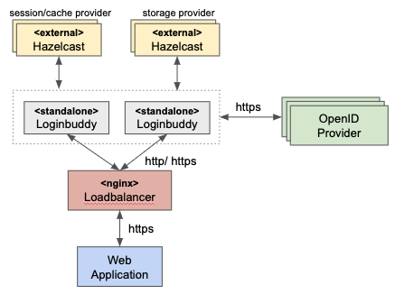

# Using nginx as loadbalancer to front two Loginbuddy instances

**NOTE**: Before you continue here, make sure to follow the setup instructions in *README* in the samples root directory!

Nginx may be used as a load balancer in front of two or more Loginbuddy instances. This demo includes two possible configurations:

- 1: `[client] -- https --> [nginx] -- http --> [loginbuddy]`
- 2: `[client] -- https --> [nginx] -- https --> [loginbuddy]`

The cluster setup looks like this:

The cluster setup is represented like this in the demo:

- *democlient.loginbuddy.net*: Web Application
- *local.loginbuddy.net*: Loadbalancer
- *loginbuddy1*, *loginbuddy2*: standalone Loginbuddy instances
- *hazelcast1*, *hazelcast2*: external hazelcast instances
- *demoserver.loginbuddy.net*: OpenID provider

## Configuration 1: https - http

Update the **nginx_ssl.conf** to your needs. By default, it uses these values:

- **Loginbuddy**
  - Loginbuddy listening on http port 8080 which is not exposed externally and does not forward to SSL
- **Loadbalancer**
  - listens on SSL port 8444 (which requires no updates of the samples project)
  - proxies requests (round robin) to any Loginbuddy instance as configured in nginx_ssl.conf

## Configuration 2: https - https

Update the **nginx_ssl_ssl.conf** to your needs. By default, it uses these values:

- **Loginbuddy**
  - Loginbuddy listening on https port 8444 which is not exposed externally
- **Loadbalancer**
  - listens on SSL port 8444 (which requires no updates of the samples project)
  - proxies requests (round robin) to any Loginbuddy instance as configured in nginx_ssl.conf

## Loadbalancer key and cert for inbound SSL connections

For development purposes, run this command to create a key and a certificate:

- `openssl req -x509 -nodes -days 365 -newkey rsa:2048 -keyout loadbalancer.key -out loadbalancer.crt -subj "/CN=local.loginbuddy.net"`
  
FYI: Find a discussion on non-interactive cert creation here:

- [non-interactive cert creation](https://serverfault.com/questions/649990/non-interactive-creation-of-ssl-certificate-requests)
- example for subj: `-subj "/C=PE/ST=Lima/L=Lima/O=Acme Inc. /OU=IT Department/CN=acme.com"`

## Build the loadbalancer and Loginbuddy

- `make build_all`
  - if this fails, make sure you ran the *openssl* command from above and created development ssl keys for the samples project!

This will produce new images

- **local/loadbalancer-http:latest**
  - this is a nginx loadbalancer that uses configuration 1 (https -- http)
- **local/loadbalancer:latest**
  - this is a nginx loadbalancer that uses configuration 2 (https -- https)
- **local/loginbuddy-http:latest**
  - this is Loginbuddy, using configurations required to be used in a cluster via http
  - *web.xml* does not include security directions
  - *server.xml* opens port 8080 which is http only and does not forward to any SSL ports
  - *logging.properties* set to loglevel INFO

## Cluster setup

- relying parties (clients) connect to **https://local.loginbuddy.net:8444** (which is the load balancer)
- loadbalancer connects to **loginbuddy1:8080**, **loginbuddy2:8080**. Both have *local.loginbuddy.net* configured as hostname
  - with configuration 2 the loadbalancer connects to **loginbuddy1:8444**, **loginbuddy2:8444**
- loginbuddy1, loginbuddy2 connect to **hazelcast1:5701**, **hazelcast2:5701** which is a hazelcast cluster for shared caching, session management and storage
- loginbuddy1, loginbuddy2 connect to OpenID Connect providers
- OpenID Connect providers redirect back to loadbalancer